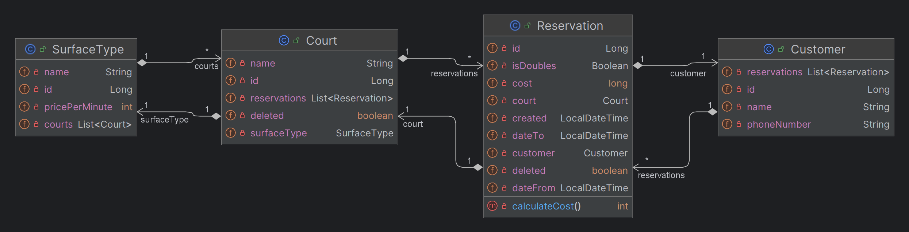

# Tennis Club Application

This is a simple application for a tennis club. It allows users to manage courts and reservations.

It includes:
- RUD operations for courts
- CRUD operations for reservations
- access to list of reservations for a given court sorted by creation date
- access to list of reservations for a given customer with option to see only future reservations
- create reservation for a given court and customer with date validation, court availability check and cost calculation

Technologies used:
- Spring Boot
- Spring Data JPA
- H2 database
- Hibernate
- Lombok
- Swagger
- JUnit
- Mockito
- Liquibase

### How to run the application

1. Clone the repository
2. Run the application
3. Access the Swagger UI at http://localhost:8080/swagger-ui/index.html#/

### UML Class diagram:

